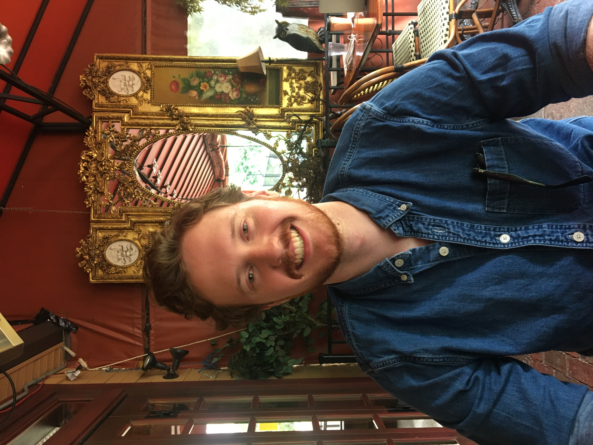

# Lane Cuthbert
Welcome! I'm a Ph.D. student at the [University of Massachusetts, Amherst](https://polsci.umass.edu/). I study public opinion, political behavior, and campaign finance. My work focuses on how the mass public understands and endorses elite rhetoric and the cognitive processes involved. I also study campaign finance to uncover ways candidates, donors, and interest groups influence elections and voter behavior. 

You can find my tweets at [@LaneGCuthbert](https://twitter.com/LaneGCuthbert). 

